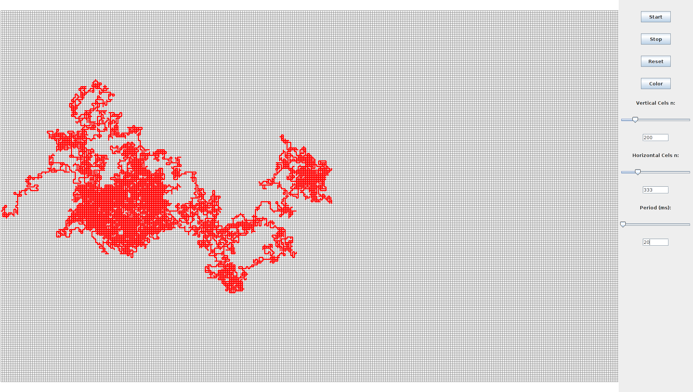

#Caminos Aleatorios

El camino aleatorio o paseo aleatorio [1], abreviado en ingles como RW ( Random Walks), es una formalizacion matemática de la trayectoria que resulta de hacer sucesivos pasos aleatorios. Por ejemplo, la ruta trazada por una molecula mientras viaja por un líquido o un gas, el camino que sigue un animal en su busqueda de comida, el precio de una acción fluctuante y la situación financiera de un jugador pueden tratarse como un camino aleatorio.

